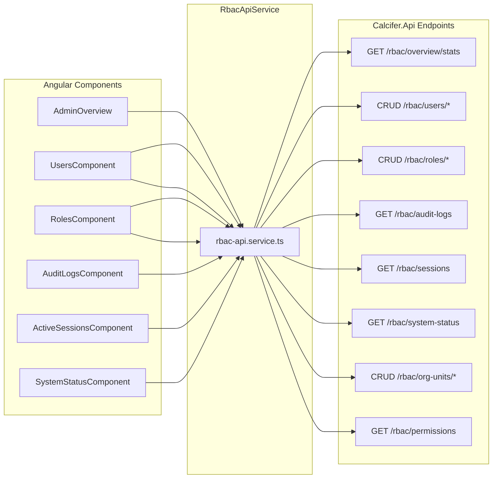

# 🏗️ Administration Module — API Blueprint & Service Architecture

> Complete API specification for the **Calcifer.Api RBAC engine** powering the Angular Administration module.
> All endpoints live under `/api/v1/rbac/*` and return `ApiResponseDto<T>`.

---

## Files Created / Modified

| File | Action | Purpose |
|------|--------|---------|
| [rbac.model.ts](file:///d:/alpha/angular/weavo-Go/src/app/features/administration/models/rbac.model.ts) | **Created** | All TypeScript interfaces aligned 1:1 with .NET DTOs |
| [rbac-api.service.ts](file:///d:/alpha/angular/weavo-Go/src/app/features/administration/services/rbac-api.service.ts) | **Created** | Central HTTP service for all RBAC endpoints |
| [api-endpoints.const.ts](file:///d:/alpha/angular/weavo-Go/src/app/core/constants/api-endpoints.const.ts) | **Updated** | Expanded `ADMIN` section with full RBAC routes |
| [models/index.ts](file:///d:/alpha/angular/weavo-Go/src/app/features/administration/models/index.ts) | **Created** | Barrel export |
| [services/index.ts](file:///d:/alpha/angular/weavo-Go/src/app/features/administration/services/index.ts) | **Created** | Barrel export |

---

## 📡 Required API Endpoints (Build These)

> [!IMPORTANT]
> All endpoints return `ApiResponseDto<T>` wrapper: `{ Status: bool, Message: string, Data: T }`
> All endpoints require `[Authorize]`. Role/Permission checks noted per endpoint.

---

### 1. Overview Stats

| Method | Endpoint | Response | Permission |
|--------|----------|----------|------------|
| `GET` | `/rbac/overview/stats` | `AdminOverviewStats` | `Administration:Overview:Read` |

```csharp
// Response shape
record AdminOverviewStats(
    int ActiveUsers,
    int TotalUsers, 
    int RolesCount,
    int AuditEventsLast7Days,
    int ActiveSessionsCount,
    string SystemUptime
);
```

**Used by:** `AdminOverviewComponent` — quick stats bar + feature cards

---

### 2. Permissions Catalog

| Method | Endpoint | Request | Response | Permission |
|--------|----------|---------|----------|------------|
| `GET` | `/rbac/permissions` | — | `PermissionDto[]` | `Administration:Permissions:Read` |
| `GET` | `/rbac/permissions/{id}` | — | `PermissionDto` | `Administration:Permissions:Read` |

**Used by:** `RolesComponent` permission matrix, `UsersComponent` grant-access modal

---

### 3. Roles

| Method | Endpoint | Request | Response | Permission |
|--------|----------|---------|----------|------------|
| `GET` | `/rbac/roles` | — | `RoleDto[]` | `Administration:Roles:Read` |
| `GET` | `/rbac/roles/{id}` | — | `RoleDto` | `Administration:Roles:Read` |
| `POST` | `/rbac/roles` | `CreateRoleRequest` | `RoleDto` | `Administration:Roles:Create` |
| `PUT` | `/rbac/roles/{id}` | `UpdateRoleRequest` | `RoleDto` | `Administration:Roles:Update` |
| `DELETE` | `/rbac/roles/{id}` | — | `void` | `Administration:Roles:Delete` |

```csharp
record CreateRoleRequest(string Name, string Description);
record UpdateRoleRequest(string? Name, string? Description);

// RoleDto includes computed fields
record RoleDto(
    string Id, string Name, string Description,
    bool IsSystem, int UsersCount, int PermissionCount,
    string LastUpdated
);
```

**Used by:** `RolesComponent` — left panel role list, create/edit/delete

---

### 4. Role → Permissions

| Method | Endpoint | Request | Response | Permission |
|--------|----------|---------|----------|------------|
| `GET` | `/rbac/roles/{roleId}/permissions` | — | `RolePermissionDto[]` | `Administration:Roles:Read` |
| `POST` | `/rbac/roles/{roleId}/permissions` | `AssignRolePermissionRequest` | `RolePermissionDto` | `Administration:Roles:Update` |
| `DELETE` | `/rbac/roles/{roleId}/permissions/{permId}` | — | `void` | `Administration:Roles:Update` |
| `PUT` | `/rbac/roles/{roleId}/permissions` | `{ permissionIds: int[] }` | `{ message }` | `Administration:Roles:Update` |

> [!TIP]
> The `PUT` (bulk sync) endpoint is the most practical for the permission matrix UI — send the complete set of permission IDs after toggling checkboxes.

**Used by:** `RolesComponent` — right panel permission matrix (module-grouped checkboxes)

---

### 5. Users

| Method | Endpoint | Request | Response | Permission |
|--------|----------|---------|----------|------------|
| `GET` | `/rbac/users` | — | `AdminUserDto[]` | `Administration:Users:Read` |
| `GET` | `/rbac/users/{id}` | — | `AdminUserDto` | `Administration:Users:Read` |
| `POST` | `/rbac/users` | `CreateUserRequest` | `AdminUserDto` | `Administration:Users:Create` |
| `PUT` | `/rbac/users/{id}` | `UpdateUserRequest` | `AdminUserDto` | `Administration:Users:Update` |
| `DELETE` | `/rbac/users/{id}` | — | `void` | `Administration:Users:Delete` |

```csharp
// AdminUserDto (hydrated for admin panel)
record AdminUserDto(
    string Id, string FirstName, string LastName,
    string Email, string? Phone, string? Department,
    int? BaseUnitId, string? BaseUnitName,
    string Status, // "active"|"inactive"|"pending"|"locked"
    string JoinedDate, string? LastLogin, string? AvatarUrl,
    List<UserUnitRoleDto> UnitRoles,
    List<DirectPermissionDto> DirectPermissions
);
```

**Used by:** `UsersComponent` — left panel user list + right panel detail tabs

---

### 6. User → Unit Roles

| Method | Endpoint | Request | Response | Permission |
|--------|----------|---------|----------|------------|
| `GET` | `/rbac/users/{userId}/unit-roles` | — | `UserUnitRoleDto[]` | `Administration:Users:Read` |
| `POST` | `/rbac/users/{userId}/unit-roles` | `AssignUnitRoleRequest` | `UserUnitRoleDto` | `Administration:Users:Update` |
| `POST` | `/rbac/users/{userId}/unit-roles/revoke` | `RevokeUnitRoleRequest` | `void` | `Administration:Users:Update` |

```csharp
record AssignUnitRoleRequest(string RoleId, int UnitId, DateTime? ValidFrom, DateTime? ValidTo);
record RevokeUnitRoleRequest(string RoleId, int UnitId);
```

**Used by:** `UsersComponent` → Roles tab → Assign Role modal

---

### 7. User → Direct Permissions

| Method | Endpoint | Request | Response | Permission |
|--------|----------|---------|----------|------------|
| `GET` | `/rbac/users/{userId}/direct-permissions` | — | `DirectPermissionDto[]` | `Administration:Users:Read` |
| `POST` | `/rbac/users/{userId}/direct-permissions` | `SetDirectPermissionRequest` | `DirectPermissionDto` | `Administration:Users:Update` |
| `DELETE` | `/rbac/users/{userId}/direct-permissions/{permId}` | — | `void` | `Administration:Users:Update` |

**Used by:** `UsersComponent` → Permissions tab → Grant Access modal

---

### 8. User → Effective Permissions (Cache)

| Method | Endpoint | Response | Permission |
|--------|----------|----------|------------|
| `GET` | `/rbac/users/{userId}/permissions` | `UserPermissionSummary` | `Administration:Users:Read` |

```csharp
record UserPermissionSummary(
    string UserId, string UserName, string Email,
    List<string> Roles,
    List<string> EffectivePermissions,  // "Module:Resource:Action"
    List<DirectPermissionDto> DirectOverrides,
    DateTime CacheGeneratedAt,
    bool CacheIsStale
);
```

**Used by:** `UsersComponent` → Overview tab (access summary cards)

---

### 9. Org Units

| Method | Endpoint | Request | Response | Permission |
|--------|----------|---------|----------|------------|
| `GET` | `/rbac/org-units` | — | `OrgUnitDto[]` | `Administration:OrgUnits:Read` |
| `GET` | `/rbac/org-units/tree` | — | `OrgUnitDto[]` (nested) | `Administration:OrgUnits:Read` |
| `GET` | `/rbac/org-units/{id}` | — | `OrgUnitDto` | `Administration:OrgUnits:Read` |
| `POST` | `/rbac/org-units` | `CreateOrgUnitRequest` | `OrgUnitDto` | `Administration:OrgUnits:Create` |
| `PUT` | `/rbac/org-units/{id}` | Partial `CreateOrgUnitRequest` | `OrgUnitDto` | `Administration:OrgUnits:Update` |
| `DELETE` | `/rbac/org-units/{id}` | — | `void` | `Administration:OrgUnits:Delete` |

**Used by:** `UsersComponent` → Assign Role modal (business unit dropdown)

---

### 10. Audit Logs

| Method | Endpoint | Query Params | Response | Permission |
|--------|----------|-------------|----------|------------|
| `GET` | `/rbac/audit-logs` | `search, module, action, status, userId, fromDate, toDate, page, pageSize` | `PaginatedResponse<AuditLogDto>` | `Administration:AuditLogs:Read` |
| `GET` | `/rbac/audit-logs/export` | Same as above | `Blob` (CSV/Excel) | `Administration:AuditLogs:Read` |

```csharp
// PaginatedResponse<T>
record PaginatedResponse<T>(
    List<T> Items, int TotalCount,
    int Page, int PageSize, int TotalPages
);

record AuditLogDto(
    string Id, string Timestamp,
    string UserId, string UserName, string UserEmail,
    string Action, string Module, string Resource,
    string? ResourceId, string Details,
    string Status, // "success"|"failure"|"warning"
    string IpAddress, string? Location,
    string? OldValue, string? NewValue
);
```

**Used by:** `AuditLogsComponent` — filtered table with pagination + export button

---

### 11. Active Sessions

| Method | Endpoint | Request | Response | Permission |
|--------|----------|---------|----------|------------|
| `GET` | `/rbac/sessions` | — | `ActiveSessionDto[]` | `Administration:Sessions:Read` |
| `POST` | `/rbac/sessions/{sessionId}/revoke` | — | `{ message }` | `Administration:Sessions:Delete` |
| `POST` | `/rbac/sessions/revoke-all` | — | `{ message }` | `Administration:Sessions:Delete` |

**Used by:** `ActiveSessionsComponent` — session cards with revoke buttons

---

### 12. System Status

| Method | Endpoint | Response | Permission |
|--------|----------|----------|------------|
| `GET` | `/rbac/system-status` | `SystemHealthDto` | `Administration:SystemStatus:Read` |

**Used by:** `SystemStatusComponent`

---

## 🔐 Required Permission Seeds

> [!IMPORTANT]
> Seed these permissions into the `Permissions` table. The `Key` format is `Module:Resource:Action`.

```sql
-- Administration Module Permissions
INSERT INTO Permissions (Module, Resource, Action, Description) VALUES
('Administration', 'Overview',     'Read',   'View admin overview dashboard'),
('Administration', 'Users',        'Read',   'View user list and details'),
('Administration', 'Users',        'Create', 'Create new users'),
('Administration', 'Users',        'Update', 'Edit user profiles and assign roles'),
('Administration', 'Users',        'Delete', 'Delete/deactivate users'),
('Administration', 'Roles',        'Read',   'View roles and permission matrix'),
('Administration', 'Roles',        'Create', 'Create new roles'),
('Administration', 'Roles',        'Update', 'Edit role permissions'),
('Administration', 'Roles',        'Delete', 'Delete custom roles'),
('Administration', 'Permissions',  'Read',   'View permission catalog'),
('Administration', 'OrgUnits',     'Read',   'View organization units'),
('Administration', 'OrgUnits',     'Create', 'Create organization units'),
('Administration', 'OrgUnits',     'Update', 'Edit organization units'),
('Administration', 'OrgUnits',     'Delete', 'Delete organization units'),
('Administration', 'AuditLogs',    'Read',   'View and export audit logs'),
('Administration', 'Sessions',     'Read',   'View active sessions'),
('Administration', 'Sessions',     'Delete', 'Revoke sessions'),
('Administration', 'SystemStatus', 'Read',   'View system health status');
```

---

## 🔄 Component → API Mapping



---

## 📋 Backend Implementation Checklist

- [ ] `GET /rbac/overview/stats` — Aggregate query across Users, Roles, AuditLogs, Sessions tables
- [ ] `GET /rbac/permissions` — Return all seeded permissions
- [ ] `CRUD /rbac/roles` — ASP.NET Identity RoleManager + custom permission link table
- [ ] `GET/POST/DELETE /rbac/roles/{id}/permissions` — Join table `RolePermissions`
- [ ] `PUT /rbac/roles/{id}/permissions` — Bulk sync (delete all + re-insert)
- [ ] `CRUD /rbac/users` — ASP.NET Identity UserManager with extended profile
- [ ] `GET/POST /rbac/users/{id}/unit-roles` — `UserUnitRoles` table with `ValidFrom/ValidTo`
- [ ] `POST /rbac/users/{id}/unit-roles/revoke` — Soft-delete or remove from `UserUnitRoles`
- [ ] `GET/POST/DELETE /rbac/users/{id}/direct-permissions` — `UserDirectPermissions` table
- [ ] `GET /rbac/users/{id}/permissions` — Compute effective permissions from roles + directs + cache
- [ ] `CRUD /rbac/org-units` — Self-referencing tree table with `ParentId`
- [ ] `GET /rbac/org-units/tree` — Recursive CTE or EF Include for nested children
- [ ] `GET /rbac/audit-logs` — Paginated query with filters, `ORDER BY Timestamp DESC`
- [ ] `GET /rbac/audit-logs/export` — Same query → CSV/Excel via EPPlus or ClosedXML
- [ ] `GET /rbac/sessions` — Query active JWT refresh tokens / session store
- [ ] `POST /rbac/sessions/{id}/revoke` — Invalidate refresh token + add to blacklist
- [ ] `POST /rbac/sessions/revoke-all` — Bulk invalidate (except current)
- [ ] `GET /rbac/system-status` — Health check aggregator (DB, cache, external services)
